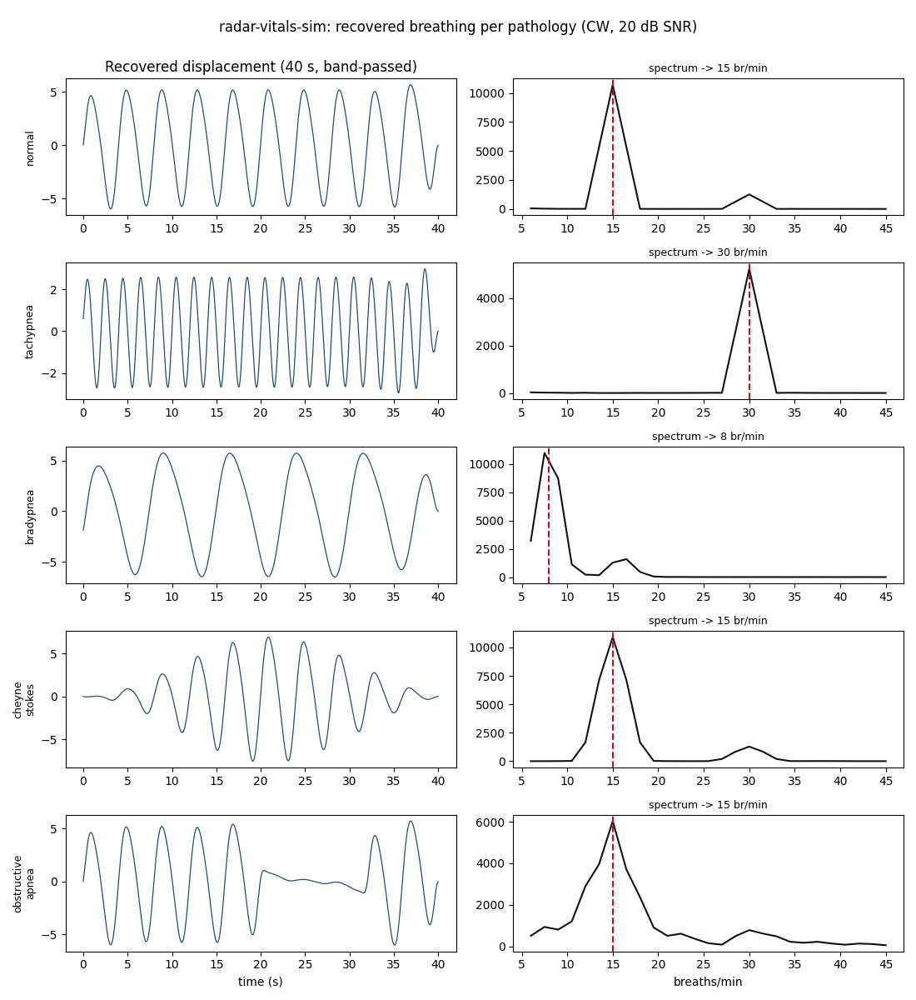

# radar-vitals-sim

A physics-grounded **simulation** of CW and FMCW radar sensing of a person's breathing and
gross body movement — built without Isaac Sim or any licensed software. It generates
synthetic radar returns from a moving chest wall for five clinically realistic breathing
patterns, recovers the breathing rate via **I/Q demodulation and FFT**, classifies which
pathology produced a signal, and flags fall events.

This is a **lite, buildable proof-of-concept** for a larger Isaac-Sim radar simulation
proposal — working code to bring to that conversation, not a replacement for the full
platform.



*Recovered breathing per pathology (CW radar, 20 dB SNR): normal, tachypnea, bradypnea,
Cheyne-Stokes (crescendo-decrescendo), and obstructive apnea (note the flat apneic gap).*

## Quick start

Requires **Python 3.10+**. On Windows (PowerShell):

```powershell
python -m venv venv
.\venv\Scripts\Activate.ps1
pip install -r requirements.txt
python run_demo.py
```

On macOS/Linux use `python3 -m venv venv && source venv/bin/activate`. `run_demo.py` prints
breathing-rate and pathology estimates for all five patterns, demonstrates fall detection,
and writes `docs/demo.png`.

## How it works

```
breathing model  d(t)  (mm)         src/breathing_models.py
   -> CW radar    I=A cos(4πd/λ), Q=A sin(4πd/λ)   src/cw_radar.py     (24 GHz, λ=12.5 mm)
      -> thermal noise / phase jitter               src/noise.py
         -> demod  atan2(Q,I) + unwrap -> d(t)       src/demodulation.py
            -> band-pass 0.1-0.5 Hz + FFT -> rate    src/rate_extraction.py
            -> features -> RandomForest -> pathology  src/classifier.py
   -> FMCW range series R(t)=R0+d(t) (cross-check)   src/fmcw_radar.py
   -> fall: short-time energy of phase velocity       src/fall_detection.py
```

The CW/FMCW models are the hand-rolled NumPy phase-modulation math that stands in for
`radarsimpy` (not installable via pip); it is scientifically equivalent for this scope.
Full derivation and parameter sources are in **[docs/physics_notes.md](docs/physics_notes.md)**.

## Results

Measured by `validation/run_validation.py` (25 trials × 5 patterns × 3 SNRs for rate; 50
trials/class for the classifier). Full write-up in
**[validation/validation_report.md](validation/validation_report.md)**.

**Breathing-rate accuracy** (recovered vs. ground-truth rate):

| SNR (dB) | Rate MAE (breaths/min) |
|--:|--:|
| 20 | 0.00 |
| 10 | 0.00 |
| 0 | 5.16 |

**Pathology classification** — held-out accuracy is strongly SNR-dependent:

| SNR (dB) | Accuracy |
|--:|--:|
| 20 | 100% |
| 10 | 100% |
| 0 | 39% |

At usable SNR the five patterns separate cleanly; at 0 dB the hardest class is obstructive
apnea (thermal noise fills the apneic pauses, so it resembles normal breathing). See the
confusion matrix in the report.

**Fall detection** cleanly separates a fall from breathing (energy ratio ~10⁵ vs ~3).

## Tests

Every physics and DSP function is covered by unit tests, including the CW round-trip physics
check:

```powershell
pytest
```

## Repository layout

```
src/            breathing_models, cw_radar, fmcw_radar, demodulation,
                rate_extraction, noise, classifier, fall_detection
tests/          pytest unit tests (round-trip physics, rates, classifier, fall)
validation/     batch validation harness, results.csv, report, confusion matrix
docs/           physics notes + demo figure
run_demo.py     end-to-end demo (prints estimates, writes docs/demo.png)
```

## Next steps — toward the full Isaac Sim platform

This proof-of-concept establishes the radar signal-processing backbone (phase demodulation,
FFT rate extraction, pathology classification, fall detection). The full proposal would add:

- **Isaac Sim / USD / PhysX room environment** — a physically simulated room, furniture, and
  animated human body so radar returns include realistic multipath and clutter rather than a
  single-target phase model.
- **True FMCW chirp synthesis and range-Doppler processing** instead of the simplified range
  model, enabling multi-person and body-part separation.
- **A ROS 2 bridge** to stream simulated (and later real) radar into a live monitoring
  pipeline (out of scope here; noted as future work).
- **Larger, validated pathology set** and evaluation against real radar recordings.

## Related project

A companion project, **rppg-vitals**, extracts heart rate and breathing rate from an
ordinary webcam using remote photoplethysmography. Together they cover optical and radar
approaches to the same contactless vital-signs problem; the radar path is robust to lighting
and works in the dark and through clothing.

## Acknowledgements

- Microwave Doppler-radar vital-signs background: Droitcour (Stanford, 2006); Li & Lin
  (IEEE MTT, 2010).
- `radarsimpy` inspired the radar-model API; this project uses an equivalent NumPy
  implementation because `radarsimpy` is not distributed on PyPI.
