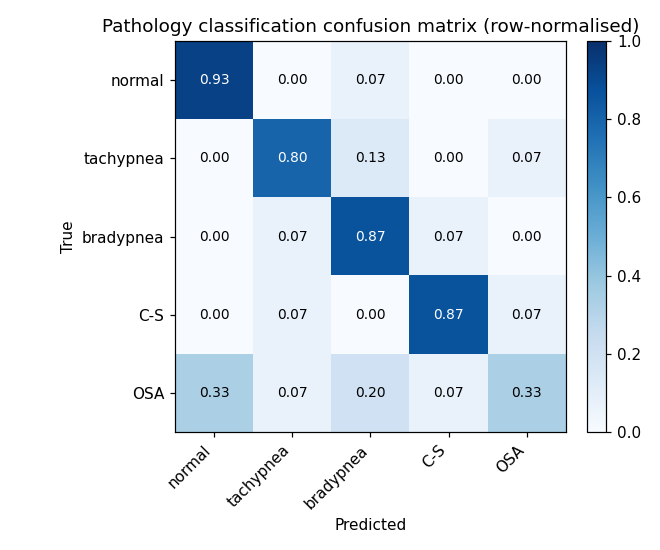

# Validation Report — radar-vitals-sim

## Methodology

Each trial randomises a breathing pattern's parameters, renders chest displacement `d(t)`, passes it through the CW radar model (`I=A cos(4πd/λ)`, `Q=A sin(4πd/λ)` at 24 GHz), adds white Gaussian thermal noise at a target SNR, demodulates (arctan + unwrap), and either estimates the breathing rate (FFT) or extracts features for the pathology classifier. All numbers below are measured from real runs of `validation/run_validation.py`.

## Breathing-rate accuracy vs SNR

Mean absolute error of the recovered rate versus the known ground-truth rate (band 0.1–0.9 Hz, widened from the 0.1–0.5 Hz reporting band so tachypnea >30 br/min is measurable):

| SNR (dB) | Rate MAE (breaths/min) |
|--:|--:|
| 20 | 0.00 |
| 10 | 0.00 |
| 0 | 5.16 |
| **all** | **1.72** |

Rate extraction is accurate at high SNR and degrades gracefully as noise rises, as expected when the demodulated phase becomes noisier.

## Pathology classification

Held-out accuracy (30% test split, all SNRs pooled): **76.0%** across the five patterns. Accuracy is strongly SNR-dependent:

| SNR (dB) | Classifier accuracy |
|--:|--:|
| 20 | 100.0% |
| 10 | 100.0% |
| 0 | 38.8% |

The rate-defined patterns (normal / tachypnea / bradypnea) separate cleanly on the rate feature. The hardest class is **obstructive_apnea** (recall 33%), most often mistaken for **normal**. This matches the physics: at low SNR the envelope-based features that distinguish the cyclic patterns — apnea-gap fraction and envelope variation — wash out first (thermal noise fills the apneic pauses), so obstructive_apnea starts to resemble normal. At high SNR the classifier is far more reliable, as the per-SNR table shows.

## Known limitations

* **Simulation, not hardware.** The CW/FMCW models are phase-modulation math, not measured radar returns; real returns add clutter, multipath, and hardware effects.
* **Single target, no room.** No multipath, body-part separation, or Isaac-Sim room physics — that is the scope of the full proposal (see README Next Steps).
* **obstructive_apnea at low SNR** is the hardest class, as the confusion matrix shows.
* **'Rate' for cyclic patterns** is the intra-burst rate by definition (see `docs/physics_notes.md`); it is not meaningful during apneic pauses.

_Generated by `validation/run_validation.py`._